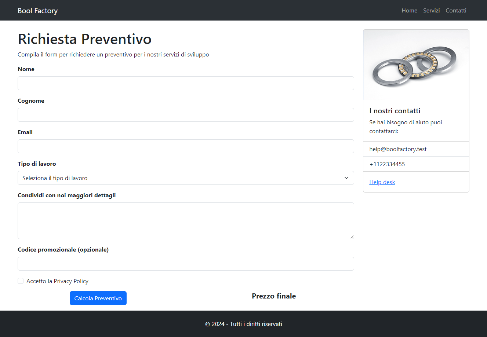

Consegna
Step 1 (UI)
●	Alcuni consigli utili:
Individuate le macro-aree di layout e cominciate creando lo scheletro HTML della pagina (aiutatevi con i commenti <!-- --> e con i giusti tag HTML)
●	Implementate area per area aiutandovi con la documentazione: osservate bene se ci possono essere dei “Components” già fatti che vi possono aiutare a raggiungere più velocemente il risultato e aiutatevi con le classi messe a disposizione da Bootstrap (margini, padding, colori, colori di sfondo, ...)
●	I tipi di lavoro che posso commissionare sono: Backed Development, Frontend Development, Project Analysis (ma potresti anche decidere di cambiarli)
●	E’ richiesto che il layout sia responsive per poter essere visualizzato sia da desktop che da mobile

Step 2 (JavaScript)
Aggiungiamo la componente js di interazione con l’utente.
Quando l’utente fa click sul bottone submit del form, il sito deve calcolare l’ammontare del preventivo per le ore di lavoro richieste. 

Il prezzo finale è dato dal numero di ore per prezzo orario. Supponiamo per semplicità che ogni progetto richieda lo stesso numero di ore di lavoro (es: 10 ore).

Il prezzo orario per una commissione varia in questo modo:
●	se la commissione riguarda lo sviluppo backend il prezzo orario è di 20.50€/l’ora
●	se la commissione riguarda lo sviluppo frontend il prezzo orario è di 15.30€/l’ora
●	se la commissione riguarda l’analisi progettuale il prezzo orario è di 33.60€/l’ora

L’utente potrebbe decidere di utilizzare un codice promozionale tra i seguenti: YHDNU32, JANJC63, PWKCN25, SJDPO96, POCIE24.

Se l’utente inserisce un codice promozionale valido, ha diritto ad uno sconto del 25% sul prezzo finale. Se il codice inserito non è valido, il sito deve informare l’utente che il codice non è valido e il prezzo finale viene calcolato senza applicare sconti.

Il risultato del calcolo del prezzo finale deve essere visualizzato in “forma umana” (con 2 decimali e il simbolo dell’euro).
